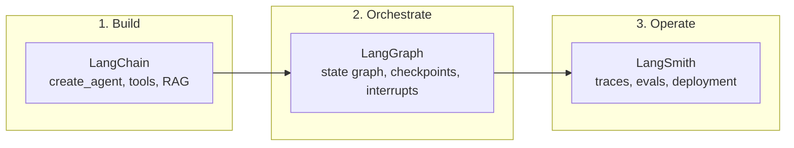
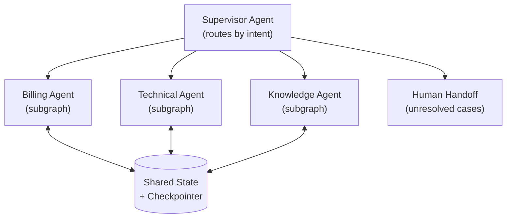
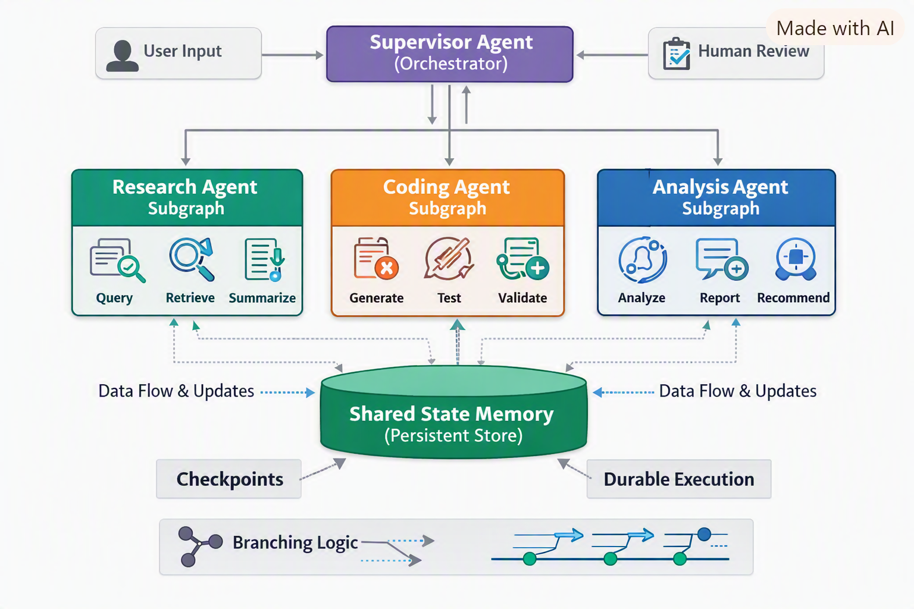

# LangChain vs LangGraph vs LangSmith

> **TL;DR** — **[LangChain](https://docs.langchain.com/)** is the framework for building LLM agents from modular components, **[LangGraph](https://docs.langchain.com/oss/python/langgraph/overview)** is the runtime for orchestrating durable, stateful, multi-agent workflows, and **[LangSmith](https://docs.langchain.com/langsmith/observability)** is the platform for observing, evaluating, and deploying them. **Build with LangChain, orchestrate with LangGraph, productionize with LangSmith.**

| | |
|---|---|
| **Last updated** | Aug 2026 |
| **Versions covered** | LangChain v1.x · LangGraph v1.x (both hit v1.0 in Oct 2025) |
| **Official docs** | [LangChain](https://docs.langchain.com/) · [LangGraph](https://docs.langchain.com/oss/python/langgraph/overview) · [LangSmith](https://docs.langchain.com/langsmith/observability) |

---

## ⚡ Quick Decision Guide

| If you need… | Use |
|---|---|
| To prototype an agent, RAG pipeline, or chatbot fast | **LangChain** (`create_agent`) |
| Durable, branching, looping, or long-running workflows | **LangGraph** |
| Multiple specialized agents coordinating on one task | **LangGraph** (supervisor / subgraph patterns) |
| Human approvals inside a workflow | **LangGraph** interrupts + **LangSmith** review queues |
| Tracing, evaluation, cost & latency monitoring | **LangSmith** |
| Managed deployment with versioning and rollbacks | **LangSmith Deployment** (formerly LangGraph Platform) |

---

## 🔑 Feature Comparison

| Feature | **LangChain** | **LangGraph** | **LangSmith** |
|---------|---------------|---------------|----------------|
| **Core role** | Framework for building agents from modular components (models, tools, middleware). | Runtime for orchestrating long-running, stateful, multi-agent workflows. | Platform for tracing, evaluation, monitoring, and deployment. |
| **Workflow type** | Single agents and tool-calling loops (v1 `create_agent`). | Complex graphs mixing deterministic + agentic steps. | Observability layer over any workflow or framework. |
| **Memory** | Agent-scoped message history (via the underlying LangGraph runtime). | First-class state: short-term thread state + long-term stores. | Captures traces of memory/state usage for debugging. |
| **Durability** | Inherits durability from LangGraph (v1 `create_agent` is built on LangGraph). | Durable execution with checkpointing and crash recovery. | Detects failures and clusters issues in production. |
| **Human-in-the-loop** | Pre-built middleware (e.g., approval gates). | Native interrupts at any node; pause/resume via checkpoints. | Dashboards for human feedback and evaluation calibration. |
| **Integrations** | 1000+ integrations (OpenAI, Anthropic, AWS Bedrock, Hugging Face, databases, APIs). | Works with any model/tool; commonly paired with LangChain components. | Framework-agnostic (LangChain, LlamaIndex, OpenAI SDK, custom code; OTel support). |
| **Streaming** | Token-by-token streaming supported. | First-class streaming of tokens, state updates, and intermediate steps. | Monitors latency, cost, and streaming behavior. |
| **Deployment** | Open-source library; you manage hosting. | Open-source runtime; self-host or deploy via LangSmith Deployment. | Managed deployment with versioning, rollbacks, and horizontal scaling. |
| **Best use case** | Prototyping agents quickly. | Scaling complex, stateful, multi-agent systems. | Debugging, evaluating, and improving agents in production. |

---

## 🚀 How They Fit Together



- **LangChain** → Build your agent with modular components and integrations.
- **LangGraph** → Run that agent in a durable, stateful orchestration layer with retries, branching, and human-in-the-loop.
- **LangSmith** → Trace every decision, evaluate quality, and deploy with observability and governance.

> **Note:** Since v1, the boundary is thinner than it used to be — LangChain's `create_agent` runs on the LangGraph runtime, so you get checkpointing and streaming even from a "plain" LangChain agent. Reach for LangGraph directly when you need explicit control over the graph.

---

## 🛠️ Practical Use Cases

### LangChain
- Rapid prototyping of chatbots and assistants.
- Retrieval-Augmented Generation (RAG) pipelines over knowledge bases.
- Connecting LLMs to external tools (APIs, databases, search engines).
- Educational apps, Q&A systems, and lightweight automation.

### LangGraph
- Multi-agent collaboration (e.g., research assistants working together).
- Complex workflows with branching, retries, and loops.
- Stateful applications where memory persistence is critical.
- Human-in-the-loop systems (approval workflows, content moderation).

### LangSmith
- Debugging and tracing agent decisions step by step.
- Evaluating outputs against benchmarks or golden datasets.
- Monitoring latency, cost, and hallucination rates in production.
- Running regression tests to prevent performance drift.

---

## 🌍 Real-World Scenarios

| Scenario | LangChain | LangGraph | LangSmith |
|----------|-----------|-----------|-----------|
| **Customer support bot** | Dialogue + knowledge-base retrieval | Escalation, retries, human handoff | Accuracy tracking, cost monitoring |
| **Enterprise automation** | API & database integrations | Multi-step approval & reporting workflows | Compliance and auditability |
| **Research assistant** | Document ingestion & summarization | Coordinates planner / summarizer / critic agents | Quality & consistency evaluation |

Production adopters of LangGraph include **LinkedIn** (recruiting agents), **Uber** (automated code migration), and **Replit** (AI coding copilot) — all workflows that need durability, checkpointing, and human oversight at scale.

---

## 🧩 Multi-Agent Architecture with LangGraph

### Core Architectural Principles

- **Graph-based orchestration**
  - Agents are nodes in a directed graph; edges define transitions, including **conditional routing** on state.
  - Enables branching, retries, and parallel execution.
- **Subgraphs for modular agents**
  - Each agent is a standalone subgraph with its own state schema, independently developed and tested.
  - Example: a research subgraph handles retrieval + summarization; a coding subgraph handles generation + testing.
- **Shared state**
  - Agents communicate through a shared state object.
  - Checkpointing persists state so workflows survive restarts and failures.
- **Coordination patterns**
  - **Supervisor orchestration** — a central agent routes tasks to specialists.
  - **Scatter-gather parallelism** — agents run in parallel; results are aggregated.
  - **Pipeline processing** — agents handle sequential stages (ingest → analyze → summarize).
  - **Hierarchical teams** — supervisors manage sub-teams of agents.

### Production Features

- **Durable execution** — persistent state (Postgres, Redis, or DynamoDB via `langgraph-checkpoint-aws`) survives crashes.
- **Human-in-the-loop interrupts** — pause for approval at compliance checkpoints.
- **Streaming** — real-time visibility into intermediate reasoning steps.
- **Parallel fan-out / fan-in** — concurrent agent execution with merged results.

### Example: Enterprise Customer Support Bot



- **Supervisor agent** routes queries to billing, technical, or knowledge agents.
- **Billing subgraph** handles invoices, payments, refunds.
- **Technical subgraph** troubleshoots product issues.
- **Knowledge subgraph** retrieves documentation.
- **Human-in-the-loop** escalates unresolved cases; **LangSmith** monitors accuracy, latency, and cost.



### Common Multi-Agent Patterns

- **Router agents** — direct tasks to specialists based on intent (billing vs. technical support).
- **Tool-calling agents (ReAct)** — dynamically select tools to solve problems.
- **Adaptive RAG** — route queries to different retrieval strategies by complexity.
- **Human-in-the-loop gates** — insert approval checkpoints in sensitive workflows.

---

## 💻 Quick-Start Snippets (v1)

**LangChain — an agent in ~5 lines:**

```python
from langchain.agents import create_agent

agent = create_agent(
    model="anthropic:claude-sonnet-4-5",
    tools=[search_kb, create_ticket],
    system_prompt="You are a helpful support assistant.",
)
result = agent.invoke({"messages": [{"role": "user", "content": "Reset my password"}]})
```

**LangGraph — explicit graph control:**

```python
from langgraph.graph import StateGraph, MessagesState, START, END
from langgraph.checkpoint.postgres import PostgresSaver

builder = StateGraph(MessagesState)
builder.add_node("research", research_agent)
builder.add_node("writer", writer_agent)
builder.add_edge(START, "research")
builder.add_edge("research", "writer")
builder.add_edge("writer", END)

graph = builder.compile(checkpointer=PostgresSaver.from_conn_string(DB_URI))
```

**LangSmith — tracing with two env vars:**

```bash
export LANGSMITH_TRACING=true
export LANGSMITH_API_KEY=<your-api-key>
# All LangChain/LangGraph runs are now traced automatically.
```

---

## ☁️ Running on AWS

Because this repo focuses on AWS architectures, here's how the stack maps onto AWS services:

- **Models** — use Amazon Bedrock via the official [`langchain-aws`](https://github.com/langchain-ai/langchain-aws) package:

```python
from langchain_aws import ChatBedrockConverse

llm = ChatBedrockConverse(
    model="us.anthropic.claude-sonnet-4-5-20250929-v1:0",  # example Bedrock model ID
    region_name="us-east-1",
)
```

- **Checkpoints** — `langgraph-checkpoint-aws` provides a DynamoDB-backed checkpointer for durable state without managing Postgres/Redis.
- **Retrieval** — pair Bedrock Knowledge Bases or OpenSearch with LangChain retrievers for RAG.
- **Deployment** — self-host LangGraph Server on ECS/EKS or EC2, or use LangSmith Deployment (SaaS or hybrid) for managed scaling, versioning, and rollbacks.
- **Bedrock AgentCore** — AWS's managed agentic runtime is an alternative deployment target; LangChain agents can also call AgentCore tools (e.g., the code interpreter).

---

## ⚖️ When to Use What

- **LangChain alone** → prototypes, simple agents, linear RAG. Fast to build, minimal concepts.
- **+ LangGraph** → when you add **branching, loops, retries, multiple agents, human approvals, or long-running tasks**. Rule of thumb: if your workflow has **more than ~3 conditional branches** or must survive restarts, design it as a graph.
- **+ LangSmith** → the moment anything touches production: debugging hallucinations, evaluating quality, monitoring cost/latency, and preventing regressions.

**LangGraph is overkill for simple Q&A or linear RAG** — the graph design effort only pays off when statefulness and control flow get complex.

---

## 📌 Version Notes (Oct 2025 → present)

- **LangChain v1.0** streamlined the package around `create_agent` (built on the LangGraph runtime); legacy APIs moved to `langchain-classic`. Requires Python 3.10+.
- **LangGraph v1.0** is a stability release: graph primitives (state, nodes, edges), durable execution, streaming, and human-in-the-loop are unchanged and first-class.
- **LangGraph Platform was folded into LangSmith** as "LangSmith Deployment" — deployment, versioning, and rollbacks now live under the LangSmith umbrella.

---

## ✅ Summary

| Tool | One-liner |
|------|-----------|
| **LangChain** | Build agents quickly from modular parts. |
| **LangGraph** | Orchestrate durable, stateful, multi-agent workflows. |
| **LangSmith** | Observe, evaluate, and deploy with confidence. |

They're complementary: prototype with **LangChain**, orchestrate with **LangGraph**, and productionize with **LangSmith**. LangGraph in particular turns multi-agent systems into **modular subgraphs coordinated through shared, checkpointed state** — which is what makes enterprise-scale agent collaboration practical.

---

## 📚 References

- [LangChain docs](https://docs.langchain.com/) · [What's new in LangChain v1](https://docs.langchain.com/oss/python/releases/langchain-v1)
- [LangGraph overview](https://docs.langchain.com/oss/python/langgraph/overview) · [What's new in LangGraph v1](https://docs.langchain.com/oss/python/releases/langgraph-v1)
- [LangSmith Observability](https://docs.langchain.com/langsmith/observability) · [LangSmith Deployment](https://docs.langchain.com/langsmith/deployment)
- [LangChain & LangGraph v1.0 announcement](https://www.langchain.com/blog/langchain-langgraph-1dot0)
- [langchain-aws (Bedrock, checkpoint-aws)](https://github.com/langchain-ai/langchain-aws) · [ChatBedrockConverse reference](https://reference.langchain.com/python/langchain-aws/)
