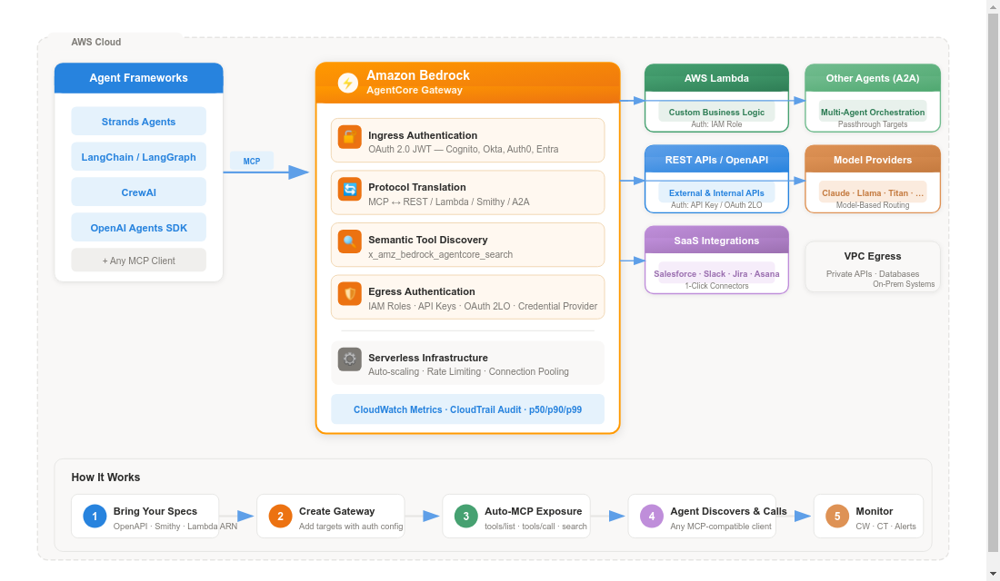

# AWS AgentCore Gateway

# AWS AgentCore Gateway: Your AI Agent's Universal Connector

> A fully managed AI gateway that turns your existing APIs, Lambda functions, and services into MCP-compatible tools — all through a single, secure endpoint.
> 

---

## The Problem It Solves

AI agents don't live in a vacuum. To be useful, they need to talk to your databases, your internal APIs, your CRM, your Slack, and — eventually — to each other. But here's the rub: every new tool you connect creates an M×N integration nightmare. Ten agents × twenty tools = 200 bespoke integrations to build, secure, and maintain.

That's before you even think about protocol translation, credential rotation, or OAuth flows.

**AgentCore Gateway** is AWS's answer to this mess.

---

## What is AgentCore Gateway?

At its heart, **Amazon Bedrock AgentCore Gateway** is a **centralized, fully managed AI gateway** that acts as the single point of contact between your agents and the outside world. Think of it as an **API gateway purpose-built for the agentic era** — but smarter, because it speaks MCP (Model Context Protocol) natively and handles all the security plumbing for you.

Here's what it does in plain English:

<aside>
💡

Gateway converts your existing enterprise resources — REST APIs, Lambda functions, even other agents — into MCP-compatible tools in just a few lines of code. No custom MCP server to build. No infrastructure to manage. No protocol headaches.

</aside>

---

## The Architecture in a Nutshell



AgentCore Gateway Architecture

---

## Core Capabilities

### 1. 🔐 Dual-Sided Security Model

Gateway is the **only** fully managed service that handles **both** sides of the authentication equation:

| Direction | What It Does | Mechanisms |
| --- | --- | --- |
| **Ingress** (who's calling?) | Validates agent identity before letting them near your tools | OAuth 2.0 JWT (Cognito, Okta, Auth0, Entra) |
| **Egress** (can we call out?) | Manages credentials for accessing backend services | IAM (Lambda/Smithy), API Key, OAuth 2LO Client Credentials |

Credentials are stored in **AgentCore Identity's resource credential provider** — no hardcoded secrets, automatic token refresh, fully auditable.

### 2. 🔄 Automatic Protocol Translation

You bring an OpenAPI spec, a Smithy model, or a Lambda function ARN. Gateway automatically:

- Exposes it as an MCP tool (supporting `tools/list`, `tools/call`, `resources/read`, `prompts/get`)
- Handles MCP `streamable-http` transport
- Manages version compatibility across MCP spec revisions

**Zero protocol code. Zero MCP server to maintain.**

### 3. 🧠 Semantic Tool Discovery

When you have 500+ tools, dumping them all into every agent's prompt is a recipe for hallucination and latency. Gateway ships with a built-in tool called `x_amz_bedrock_agentcore_search` that lets agents:

- Search for tools using **natural language queries**
- Discover only the relevant tools for the current task
- Dramatically reduce prompt size and improve accuracy

```python
# Instead of listing all 500 tools, your agent does:
tools = agent.search_tools("find tools related to order management and shipping")
# Gets back 3-5 relevant tools instead of 500
```

### 4. 🧩 Composition: One Endpoint, Many Backends

A single Gateway can front **multiple targets** simultaneously:

- **OpenAPI Targets** — Any REST API with an OpenAPI specification
- **Lambda Targets** — Any AWS Lambda function with a defined tool schema
- **Smithy Targets** — AWS-native API models (great for internal AWS services)
- **Passthrough Targets** — Front other agents via A2A (Agent-to-Agent) protocol
- **Model Routing** — Route inference requests across multiple model providers through one endpoint

### 5. ⚡ One-Click Integrations

Gateway offers pre-built connectors for popular SaaS tools:

> Salesforce · Slack · Jira · Asana · Zendesk
> 

Connect them with a few clicks — no custom integration code needed.

---

## Supported Target Types at a Glance

| Target Type | Auth (Egress) | Best For |
| --- | --- | --- |
| **OpenAPI Specification** | API Key or OAuth 2LO | Existing REST APIs, third-party services, internal microservices |
| **AWS Lambda** | IAM Role | Custom business logic, serverless compute, data transformations |
| **Smithy Model** | IAM Role | AWS service integrations, SDK-defined APIs |
| **Passthrough (A2A)** | Varies | Multi-agent orchestration, agent chaining |
| **Model Routing** | Managed | Unified inference across Claude, Llama, Titan, etc. |

---

## Key Benefits

### 🚀 Accelerate Development

- Turn existing APIs into agent-ready tools in **minutes, not months**
- No custom MCP server code to write or maintain
- Works with any agent framework: **LangChain, LangGraph, CrewAI, Strands Agents, OpenAI Agents SDK, Claude Agent SDK**

### 🛡️ Enterprise-Grade Security

- Full OAuth 2.0 authorization flow support (both 3LO and 2LO)
- Granular access control: specify approved client IDs and audiences per gateway
- VPC egress support for private resources (databases, internal APIs, on-prem systems)
- All API interactions logged via **AWS CloudTrail** for compliance

### 📊 Built-in Observability

- **Amazon CloudWatch** metrics: Invocations, Latency, Duration, TargetExecutionTime, Throttles, Error rates
- Statistical analysis at p50, p90, p99 percentiles
- Custom dashboards and automated alerts
- Full audit trail of every tool invocation

### 🔧 Serverless & Scalable

- Fully managed — no servers, no clusters, no scaling policies to configure
- Automatic horizontal scaling based on demand
- Connection pooling and rate limiting built in

---

## Framework Compatibility

Gateway speaks MCP, and **any framework that speaks MCP can use it**:

| Framework | Integration Example |
| --- | --- |
| **Strands Agents** | `MCPClient(create_streamable_http_transport)` → `client.list_tools_sync()` |
| **LangChain / LangGraph** | `MultiServerMCPClient` with `streamable_http` transport |
| **CrewAI** | MCP client adapter |
| **OpenAI Agents SDK** | MCP integration layer |
| **Any MCP Client** | Standard MCP `streamable-http` transport |

---

## Quick Start: Create a Gateway

Here's what creating a Gateway with a Lambda target looks like in ~30 lines:

```python
import boto3

gateway_client = boto3.client('bedrock-agentcore-control')

# Step 1: Create the Gateway with Cognito OAuth
auth_config = {
    "customJWTAuthorizer": {
        "allowedClients": "<cognito_client_id>",
        "discoveryUrl": "<cognito_oidc_discovery_url>"
    }
}

response = gateway_client.create_gateway(
    name='MyFirstGateway',
    roleArn='<iam_role_arn>',
    protocolType='MCP',
    authorizerType='CUSTOM_JWT',
    authorizerConfiguration=auth_config,
    description='My first AgentCore Gateway'
)

# Step 2: Add a Lambda function as a target
lambda_config = {
    "mcp": {
        "lambda": {
            "lambdaArn": "<lambda_function_arn>",
            "toolSchema": {
                "inlinePayload": [{
                    "name": "get_weather",
                    "description": "Get current weather for a city",
                    "inputSchema": {
                        "type": "object",
                        "properties": {"city": {"type": "string"}},
                        "required": ["city"]
                    }
                }]
            }
        }
    }
}

gateway_client.create_gateway_target(
    gatewayIdentifier=response['gatewayIdentifier'],
    name='WeatherTool',
    targetConfiguration=lambda_config,
    credentialProviderConfigurations=[{"credentialProviderType": "GATEWAY_IAM_ROLE"}]
)
```

---

## How Gateway Fits in the AgentCore Ecosystem

AgentCore Gateway is one piece of a larger platform:

| Service | Role |
| --- | --- |
| **AgentCore Runtime** | Serverless execution environment for agents and MCP servers |
| **AgentCore Gateway** | **← You are here** — Unified, secure tool connectivity layer |
| **AgentCore Memory** | Session and long-term memory for personalized agent experiences |
| **AgentCore Identity** | Credential management for AWS and third-party services |
| **AgentCore Browser** | Managed web browser instances for agent web automation |
| **AgentCore Code Interpreter** | Isolated code execution sandbox for agents |
| **AgentCore Observability** | Tracing, metrics, and debugging for agent workflows |

---

## When Should You Use It?

✅ **Use Gateway when:**

- You have existing REST APIs or Lambda functions you want agents to use
- You need to expose dozens or hundreds of tools without building MCP servers
- You need enterprise-grade OAuth, IAM, and audit logging for agentic traffic
- You're building multi-agent systems that need to share a common tool catalog
- You want to swap models or frameworks without redoing tool integrations

❌ **Build custom MCP servers when:**

- Your tool has highly custom, non-standard protocol requirements
- You need extremely low-latency, co-located tool execution (not via HTTP)

---

## The Bottom Line

Amazon Bedrock AgentCore Gateway is AWS's bet that the future of agent development isn't about building more integrations — it's about having a **secure, intelligent layer** that makes all your existing systems agent-accessible by default.

> **Gateway eliminates weeks of custom integration code so teams can focus on what matters: building agents that actually do useful work.**
> 

---

## References

- [AWS Official Docs — AgentCore Gateway](https://docs.aws.amazon.com/bedrock-agentcore/latest/devguide/gateway.html)
- [Introducing AgentCore Gateway — AWS ML Blog](https://aws.amazon.com/blogs/machine-learning/introducing-amazon-bedrock-agentcore-gateway-transforming-enterprise-ai-agent-tool-development/)
- [AgentCore Gateway Deep Dive — Joud W. Awad](https://joudwawad.medium.com/aws-bedrock-agentcore-deep-dive-6822e4071774)
- [Gateway Part 1: Introduction — DEV Community](https://dev.to/aws-heroes/amazon-bedrock-agentcore-gateway-part-1-introduction-1pjl)
- [Building Connected AI Agents with AgentCore Gateway](https://medium.com/elevate-tech/building-connected-ai-agents-with-amazon-bedrock-agentcore-gateway-5e8f1fbdaafb)
- [Gateway + VPC Egress for Private Resources](https://aws.amazon.com/blogs/machine-learning/configuring-amazon-bedrock-agentcore-gateway-for-secure-access-to-private-resources/)
- [Amazon Bedrock AgentCore Homepage](https://aws.amazon.com/bedrock/agentcore/)